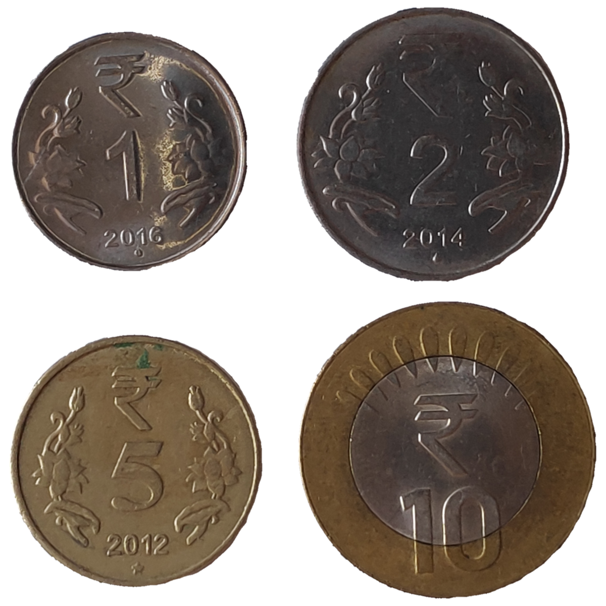
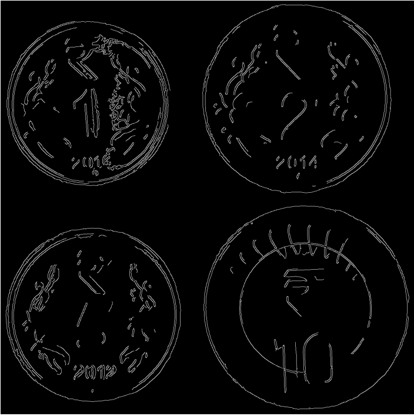
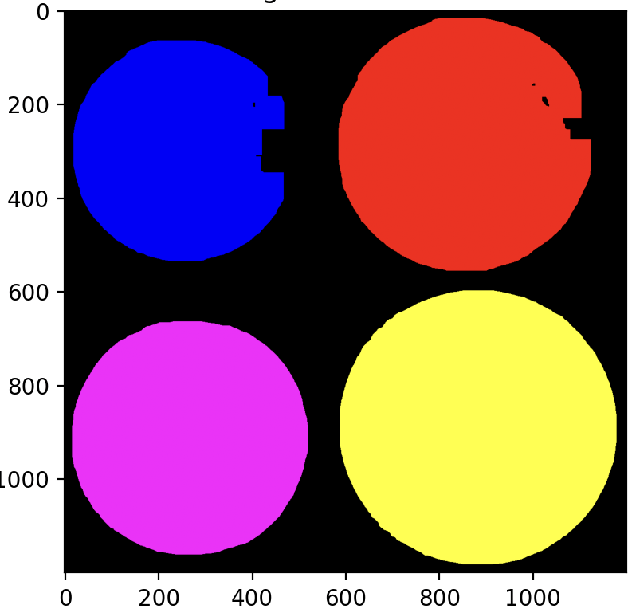

# Coin Detection and Image Stitching - OpenCV

## Overview
This project consists of two Python scripts that perform various image processing tasks including coin detection, segmentation, counting, and image stitching using SIFT keypoints.

## Project Structure
- **1.py**: Detects and segments coins in an image, counts them, and displays the results.
- **2.py**: Detects keypoints in two images, displays them, and stitches the images into a panorama.
- **images**: Contains images for input to scripts and screenshots of outputs for the same.

## Dependencies
Ensure the following Python libraries are installed:
- `opencv-python`
- `numpy`
- `matplotlib`
- `scikit-image`

Install all dependencies using:
```bash
pip install opencv-python numpy matplotlib scikit-image
```

## Running the Code
### Coin Detection and Segmentation
Run the following command to detect and segment coins:
```bash
python 1.py
```

### Image Keypoints Detection and Stitching
Run the following command to detect keypoints and stitch images:
```bash
python 2.py
```
Click key 0 to close the windows.

All outputs are displayed in separate windows when running the scripts.

## Methods Chosen
- **Canny Edge Detection** for detecting coin edges.
- **Gaussian Blur** for noise reduction.
- **Thresholding and Morphological Operations** for segmentation.
- **SIFT (Scale-Invariant Feature Transform)** for keypoints detection and image stitching.

## Results and Observations
- The coin detection pipeline successfully highlights coin edges and segments individual coins.
- 4 coin segments detected is displayed as output in the terminal.
- SIFT keypoints are accurately detected in both images.
- The final panorama combines two images using homography and RANSAC. 

### Visual Outputs
- Original Image

**Coin Detection and Edges:**  
- Canny Edge Detection Result


**Coin Segmentation:**
- Segmented Coins


**Keypoints Detection:**
- Image 1 with Keypoints

- Image 2 with Keypoints


**Final Panorama:**
- Stitched Image Result

